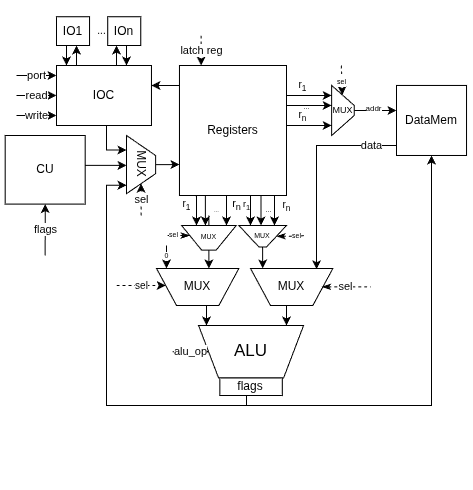

# Чураков Александр Алексеевич, P3231

Архитектуры компьютерных систем, лабораторная работа №4, 2025

вариант -> `alg | cisc | harv | hw | tick | binary | trap | port | pstr | prob2 | vector`

описание задания [здесь](https://gitlab.se.ifmo.ru/computer-systems/csa-rolling/-/blob/master/lab4-task.md)

---

## Содержание

1. [Язык программирования](#язык-программирования)
2. [Организация памяти](#организация-памяти)
3. [Система команд](#система-команд)
4. [Транслятор](#транслятор)
5. [Модель процессора](#модель-процессора)
6. [Тестирование](#тестирование)

## Язык программирования

**Синтаксис**

```
<letter>        ::= "A"…"Z" | "a"…"z" | "_"
<digit>         ::= "0"…"9"

<identifier>    ::= <letter> { <letter> | <digit> }
<int-literal>   ::= <digit> { <digit> }
<string-literal>::= '"'

<program>           ::= { <decl-or-stmt> }

<decl-or-stmt>      ::= <var-decl>
                      | <stmt>
                      | <interrupt-decl>

<var-decl>          ::= "let" <identifier> [ "=" <expression> ] ";"

<interrupt-decl>    ::= "inter" <int-literal> <block>
<iocontrol-stmt>    ::= "intOn"  ";" | "intOff" ";"

<stmt>              ::= <iocontrol-stmt>
                      | <print-stmt>
                      | <assignment>
                      | <if-stmt>
                      | <while-stmt>
                      | <block>
                      | <expression> ";"

<print-stmt>        ::= "print" "(" <expression> ")" ";"

<assignment>        ::= <lvalue> "=" <expression> ";"
<lvalue>            ::= <identifier> [ "[" <expression> "]" ]

<if-stmt>           ::= "if" <expression> <block> [ "else" <block> ]
<while-stmt>        ::= "while" <expression> <block>

<block>             ::= "{" { <decl-or-stmt> } "}"


<expression>        ::= <logic-or>
<equality>          ::= <relational>{ ("==" | "!=") <relational> }
<relational>        ::= <additive>  { ("<" | "<=" | ">" | ">=") <additive> }
<additive>          ::= <multiplicative> { ("+" | "-") <multiplicative> }
<multiplicative>    ::= <unary> { ("*" | "/") <unary> }
<unary>             ::= [ "+" | "-" ] <primary>
<primary>           ::= <literal>
                      | <lvalue>
                      | <func-call>
                      | "(" <expression> ")"

<func-call>         ::= ("addL" | "addStr") "(" [ <arg-list> ] ")";
<arg-list>          ::= <expression> { "," <expression> }

<literal>           ::= <int-literal> | <string-literal>
```

**Ключевые слова**:

`let` - объявление переменной.

```
let a = 5*(3+b);
let c = "goooooooooool";
let d = readInt();
```

`if`, `else` - условные переходы.
```
if x > 0 {
  x = 1;
} else {
  x = 2;
}
```

`while` - цикл.
``` 
while x > 0 {
  ...
}
```

`print` - вывод.

```
print("aboba");

print(a);
```


`read`, `readInt`, - ввод.

`list` - зарезервировать место под массив.
```
let arr = list(20);
arr[i] = 1;
```

`inter N {}` - описание обработки прерывания.
```
inter 0 {
  print("1");
}
```

`intOn;`, `intOff;` - ращрешить/запретить прерывания.

(идентификаторы, совпадающие с ключевым словом, зарезервированы).


**Семантика**

- Семантические пометки:

  - Переменные имеют глобальную область видимости, должны начинаться с латинской буквы, чувствительны к регистру, при объявлении должно быть явно указано значение.

  - Типизация динамическая с неявным приведением.

  - Констант нет.
  - Литералы: строки, числа.

  - Массивы — буфер “list”, доступ к элементу (побайтово) через индекс `arr[i]`;

  - Строки — Pascal-style в памяти, но на уровне языка отображаются как обычные строковые литералы;

  - Директивы `intOff;` / `intOn;` генерируют особые CISC-инструкции, запрещающие IRQ.

  - Каждое ключевое слово заканчивает инструкцию точкой с запятой, кроме заголовков управляющих конструкций (if, while, inter), за которыми следует блок `{ … }`.

  - Коментарии начинаются с `//` и идут до конца стркои.

**Стратегия вычислений**

- Код выполняется последовательно.

- Переменные должны быть объявлены до использования.

- При использовании переменной транслятор подставляет адрес значения и генерирует установку значения по адресу присваевамой переменной или формирует последовательность команд, отражающих последоватеьлность операций присваемого выражения.

- При вычислении сложных математических выражений промежуточный результат сохраняется на стеке.

- Логика обработки прерывания задается в конце файла, в блоке `inter n {}`, где `n` - номер прерывания (1 или 2).

**Память**

- Распределяется статически на этапе трансляции.

- Строковые литералы помещаются в память в начале работы программы в формате Pascal-string.

- Числовые переменные хранятся в little endian формате.

- Под массив пользователь должен заранее выделить область в памяти данных.

- Память выравнивается, если строка или массив занимает некратное 4 значение байт.

## Организация памяти

- Гарвардская архитектура
- Размер машинного слова:
  - Память инструкций - 32 бита.
  - Память данных 8 бит.
- Адресация – прямая абсолютная, 32 битная. 
- Линейное адерсное пространство.
- В памяти данных хранятся строки и переменные.
- В памяти команд хранятся инструкции и их операнды.
- Память команд - только для чтения.
- Программист не может управлять, какие регистры будут использоваться и когда будет использоваться стек.
- В начале памяти команд n ячеек занимают вектора обработки прерывания.

Регистры:

- Имеется набор 32 битных адресуемых регистров общего назначения, и несколько неадресуемых, для внутреннего исполнения инструкции.

- PC указывает на адрес исполняемой инструкции и инкрементируется на каждом такте.

- IR хранит управляющее слово инструкции.

- SP указывает на вершину стека, инициализируется при запуске процессора самостоятельно.

Организация стека:

- Стек это область памяти.
- Стек располагается в памяти данных, через фиксированное количество ячеек после последней инструкции, растет вниз.
- Пользователь не может управлять стеком напрямую.

```
      Instruction memory
+------------------------------+
| 00 : int vector 0            |
|   ...                        |
| n  : int vector n            |
| n+1: instruction             |
|   ...                        |
|  m : instruction             |
|   ...                        |
+------------------------------+

          Data memory
+------------------------------+
| 00  : var   1                |
|    ...                       |
|  n  : array 2                |
|  m  : str(len)               |
|     : str(byte1)             |
|    ...                       |
|    ...                       |
|    ...                       |
| SP  :  ...                   |
+------------------------------+
```

Прерывания:

- При поступления запроса на прерывание, если процессор находится на стадии исполнения инструкции, значение на соответствующе порту входа обновиться, но переход в прерывание наступит только после окончания исполнения инструкции.
- Вложенные прерывания запрещены.
- Если прерывание наступает во время исполнения другого, или когда в очереди уже есть прерывание, его исполнение игнорируется, но значение на входе меняется.
- Состояние процессора сохраняется во второй набор регистров и восстанавливается по окончанию.

## Система команд

- Машинное слово - 32 бита
- Доступ к памяти по адресу из регистра общего назанчения.
- Доступно присваивание переменной составных математических выражений (`+`, `-`, `*`, `/`, `(`, `)`).
- Ус-ва ввода/вывода - port-mapped, доступно 3 ус-ва.
  - IO-Char - строковый ввод/вывод, автоматически при выводе строк и переменных, указывающих на строку. `print("foo");`, `print(name);`, `let a = read();`.
  - IO-Digit - ввод/вывод 32 битных знаковых значений, автоматически в зависимости от типа аргумента. `print(1);`, `print(number);`, `let b = readInt();`.
- Поток управления:
  - Цикл `while a <= 10 {...}`
  - Условные переходы
  ```
  if points < 60 {
      print("PSJ")
  } else {
      kurs = kurs + 1
  }
  ```
  - Обработка прерываний описывается в блоке
    `inter N { ... }`

**Инструкции**

- Инструкция представляет из себя заглавное слово, в котором кодируется opcode, режим и регистры-операнды (если это ввод/вывод, то порт).
- Далее, в зависимости от режима в целых машинных словах идут операнды.

```
	31          26 25       21 20    17 16    13 12     9   8-0
	┌────────────┬──────────┬────────┬────────┬────────┬──────┐
	│  OPCODE 6b │ MODE 5b  │  RD 4b │ RS1 4b │ RS2 4b │ ...  │
	└────────────┴──────────┴────────┴────────┴────────┴──────┘
```

Детальнее - [isa.md](docs/isa.md), потактовое исполнение - [micro.go](pkg/machine/micro.go)

## Транслятор

[Реализация](pkg/translator/) в `pkg/tranlator`.

- Использование:

```
  ./tranlator -in=path [-o=dir][-debug][-h]

  go run cmd/translator/main.go [-o=dir][-debug][-h]
```
  - Флаги запуска:
    - `-debug` - дублировать логи в stdout.

    - `-h` - помощь в использовании.

    - `-o` - путь до директории, в которую сохранить бинарные файлы и логи.

- Этапы трансляции:

  - Токенизация.
  - Парсинг, построение AST-дерева.
  - Генерация машинного кода и данных в бинарные файлы `instr.bin` и `data.bin`.

- Особенности:
  - Длина строковых литералов должна помещаться в 1 байт.

## Модель процессора

[Схемы](docs/schemas/).

ControlUnit:


DataPath:



[Реализация](pkg/machine/) в `pkg/machine`.

- Использование:

  ```
  ./machine [-conf=path]
  
  go run cmd/machine/main.go [-conf=path]
  ```

    - `-conf` - путь до yaml файла конфигурации и расписания ввода, если не указать, ищет конфиг в `config/config.yaml`.

Пример конфигурации:

```
instruction_bin: "cat/instr.bin"
data_bin: "cat/data.bin"

debug: false
log_file: "cpu.log"

tick_limit: 1000
schedule:
  - tick: 50
    input:
      interrupt: 1
      value: "G"
  - tick: 300
    input:
      interrupt: 0
      value: 0

max_interruptions: 2

```

Пример бинарного файла - [`hello/instr.bin`](golden/hello/instr.bin) (конвертирован в base64):

```
AAAAAAAAAAAAAOB3AAAqBAUAAAAAADIECwAAAAA6wVEAAADDEgAAAACg7AUAAIJqACBTRgEAAAAA
oEpCAQAAAAAAAIMHAAAAAADgGw==
```

Пример выходных данных:

```
TICK    0 @ 0x77E00000 -  IntOff NoOperands; PC++ | PC=3/0x3
TICK    1 - interruptions on | false
TICK    2 @ 0x042A0000 -  MOV MvImmReg; PC++ | PC=4/0x4
TICK    3 - ROutAddr<-#5; PC++ | SP=320/0x140
TICK    4 @ 0x04320000 -  MOV MvImmReg; PC++ | PC=6/0x6
TICK    5 - RC<-#5; PC++ | SP=320/0x140
TICK    6 @ 0x51C13A00 -  CMP RegReg; PC++ | PC=8/0x8
TICK    7 - CMP RC, zero | N=0,Z=0,V=0,C=0; RC=5/0x5 zero=0/0x0
TICK    8 @ 0xC3000000 -  JE JAbsAddr; PC++ | PC=9/0x9
TICK    9 - RF2<-memI[0x9]; PC++ | RF2=18/0x12
TICK   10 - no jump | PC=10/0xA; N=0,Z=0,V=0,C=0
TICK   11 @ 0x05ECA000 -  MOV MvLowRegIndToReg; PC++ | PC=11/0xB
TICK   12 - ROutData <- memD[5] | ROutData=119/0x77
TICK   13 @ 0x6A820000 -  OUT Byte; PC++ | PC=12/0xC
TICK   14 - port 1 <- ROutData(0x77) char | [119]
TICK   15 @ 0x46532000 -  SUB MathRIR; PC++ | PC=13/0xD
TICK   16 - RF1<-memI[0xD]; PC++ | RF1=1/0x1
TICK   17 - RC<-RC-RF1 | RC=5/0x5
TICK   17 - RC<-RC-RF1 | RC=4/0x4 N=0,Z=0,V=0,C=1
TICK   18 @ 0x424AA000 -  ADD MathRIR; PC++ | PC=15/0xF
TICK   19 - RF1<-memI[0xF]; PC++ | RF1=1/0x1
TICK   20 - ROutAddr<-ROutAddr+RF1 | ROutAddr=6/0x6 N=0,Z=0,V=0,C=0
TICK   21 @ 0x83000000 -  JMP JAbsAddr; PC++ | PC=17/0x11
TICK   22 - PC<-memI[0x7]| PC=7/0x7
TICK   23 @ 0x51C13A00 -  CMP RegReg; PC++ | PC=8/0x8
TICK   24 - CMP RC, zero | N=0,Z=0,V=0,C=0; RC=4/0x4 zero=0/0x0
...
port Char | hello world
port Digit| 0 1 2 3
```

`@` - fetch

`-` - execution


**Описание реализации:**

- `hardwired` - логика дешифрации инструкции скрыта,
  [релизована](pkg/machine/cpu.go)
  на golang в методе `fetch`.
- Метод `machine.Run()` моделирует работу процессора потактово.
- Шаг моделирования соответствует выполнению одной стадии инструкции с выводом в лог.
- На каждом шаге вызывается фукнция шага `cpu.step()` которая присваивается при дешифрации инструкции, см. [micro.go](pkg/machine/micro.go) и `fetch`.
- Переполнение стека должно контроллироваться пользователем

**Ввод/вывод**

Реализация [io/controller.go](pkg/machine/io/controller.go).

## Тестирование

Запустить все тесты: `go test ./... -v` или `make test`.

Обновить конигурацию golden-тестов можно при помощи флага `-u`:

```
cd golden
go test ./golden -u
```

Запуск golden-тестов реализован в файле [golden_test.go](golden/golden_test.go),

Логика golden-тестов - [internal/testingutil/helper.go](internal/testingutil/helper.go)

Ресурсы для golden-тестов расположены в директории [golden](golden/).

**Тестовое покрытие** !TODO

- `hello` - вывести строку "hello world".
- `hello_username` - печатает на выход приветствие пользователя.
- `cat` – повторяет поток ввода на вывод.
- `ast` - проверка составления AST - [parser_test.go](pkg/translator/parser/parser_test.go).
- `math` - проверяет корректность вычислений сложных математических выражений.
- `sort` - проверяет сортировку списка чисел.
- `alg` – prob2 - считает разницу между суммой квадратов первых 100 натуральных чисел и квадратом их суммы.

CI для GitHub Actions - [cli.yml](.github/workflows/cli.yml)

Стадии CI:

- gofmt all
- golint
- test

**Пример использования**

Пример использования транслятора:

```
$ cat examples/hello           
print("hello world");

$ make build && ./bin/translator --in=examples/hello -debug             

Building translator for current platform...
go build -ldflags="-s -w -X main.version=0.1.0" -o bin/translator ./cmd/translator
Building machine for current platform...
go build -ldflags="-s -w -X main.version=0.1.0" -o bin/machine ./cmd/machine
-------------------AST----------------------
ast.BlockStmt{
  Body: []ast.Stmt{
    ast.PrintStmt{
      Argument: ast.StringExpr{
        Value: "hello world",
      },
    },
  },
}
-------------------debugAssembly----------------------
PRINT STMT
[0x0002] - 042A0000 - Opc: MOV, Mode: MvImmReg, D:ROutAddr, S1:, S2:
[0x0003] - 00000005 - Imm
[0x0004] - 04320000 - Opc: MOV, Mode: MvImmReg, D:RC, S1:, S2:
[0x0005] - 0000000B - Imm
[0x0006] - 51C13A00 - Opc: CMP, Mode: RegReg, D:, S1:RC, S2:zero
[0x0007] - C3000000 - Opc: JE, Mode: JAbsAddr, D:, S1:, S2:
[0x0008] - 03E00000 - Opc: NOP, Mode: NoOperands, D:, S1:, S2:
[0x0009] - 05ECA000 - Opc: MOV, Mode: MvLowRegIndToReg, D:ROutData, S1:ROutAddr, S2:
[0x000A] - 6A820000 - Opc: OUT, Mode: Byte, D:port Char, S1:, S2:
[0x000B] - 46532000 - Opc: SUB, Mode: MathRIR, D:RC, S1:RC, S2:
[0x000C] - 00000001 - Imm
[0x000D] - 424AA000 - Opc: ADD, Mode: MathRIR, D:ROutAddr, S1:ROutAddr, S2:
[0x000E] - 00000001 - Imm
[0x000F] - 83000000 - Opc: JMP, Mode: JAbsAddr, D:, S1:, S2:
[0x0010] - 00000006 - Imm
[0x0011] - 1BE00000 - Opc: HALT, Mode: NoOperands, D:, S1:, S2:
-------------------instructionMemory----------------------
[0x0000|0000]: 0x00000000 - 0
[0x0001|0001]: 0x00000000 - 0
[0x0002|0002]: 0x042A0000 - 69861376
[0x0003|0003]: 0x00000005 - 5
[0x0004|0004]: 0x04320000 - 70385664
[0x0005|0005]: 0x0000000B - 11
[0x0006|0006]: 0x51C13A00 - 1371617792
[0x0007|0007]: 0xC3000000 - 3271557120
[0x0008|0008]: 0x00000011 - 17
[0x0009|0009]: 0x05ECA000 - 99393536
[0x000A|0010]: 0x6A820000 - 1786904576
[0x000B|0011]: 0x46532000 - 1179852800
[0x000C|0012]: 0x00000001 - 1
[0x000D|0013]: 0x424AA000 - 1112186880
[0x000E|0014]: 0x00000001 - 1
[0x000F|0015]: 0x83000000 - 2197815296
[0x0010|0016]: 0x00000006 - 6
[0x0011|0017]: 0x1BE00000 - 467664896
-------------------dataMemory----------------------
_____
[0x0|0]: 0x10
[0x1|1]: 0x00
[0x2|2]: 0x00
[0x3|3]: 0x00
_____
[0x4|4]: 0x0B
[0x5|5]: 0x68
[0x6|6]: 0x65
[0x7|7]: 0x6C
_____
[0x8|8]: 0x6C
[0x9|9]: 0x6F
[0xA|10]: 0x20
[0xB|11]: 0x77
_____
[0xC|12]: 0x6F
[0xD|13]: 0x72
[0xE|14]: 0x6C
[0xF|15]: 0x64
-------------------SymTable--------------------------
[var_name | addres]
binaries saved to bin

$ xxd bin/instr.bin                                                                     

00000000: 0000 0000 0000 0000 0000 2a04 0500 0000  ..........*.....
00000010: 0000 3204 0b00 0000 003a c151 0000 00c3  ..2......:.Q....
00000020: 1100 0000 00a0 ec05 0000 826a 0020 5346  ...........j. SF
00000030: 0100 0000 00a0 4a42 0100 0000 0000 0083  ......JB........
00000040: 0600 0000 0000 e01b                      ........
```

Пример использования модели процессора:

```
$ ./bin/machine 

TICK    0 @ 0x042A0000 -  MOV MvImmReg; PC++ | PC=3/0x3
TICK    1 - ROutAddr<-#5; PC++ | SP=272/0x110
TICK    2 @ 0x04320000 -  MOV MvImmReg; PC++ | PC=5/0x5
TICK    3 - RC<-#11; PC++ | SP=272/0x110
TICK    4 @ 0x51C13A00 -  CMP RegReg; PC++ | PC=7/0x7
TICK    5 - CMP RC, zero | N=0,Z=0,V=0,C=0; RC=11/0xB zero=0/0x0
TICK    6 @ 0xC3000000 -  JE JAbsAddr; PC++ | PC=8/0x8
TICK    7 - RF2<-memI[0x8]; PC++ | RF2=17/0x11
TICK    8 - no jump | PC=9/0x9; N=0,Z=0,V=0,C=0
TICK    9 @ 0x05ECA000 -  MOV MvLowRegIndToReg; PC++ | PC=10/0xA
TICK   10 - ROutData <- memD[5] | ROutData=104/0x68
TICK   11 @ 0x6A820000 -  OUT Byte; PC++ | PC=11/0xB
TICK   12 - port 1 <- ROutData(0x68) char | [104]
TICK   13 @ 0x46532000 -  SUB MathRIR; PC++ | PC=12/0xC
TICK   14 - RF1<-memI[0xC]; PC++ | RF1=1/0x1
TICK   15 - RC<-RC-RF1 | RC=11/0xB
TICK   15 - RC<-RC-RF1 | RC=10/0xA N=0,Z=0,V=0,C=1
TICK   16 @ 0x424AA000 -  ADD MathRIR; PC++ | PC=14/0xE
TICK   17 - RF1<-memI[0xE]; PC++ | RF1=1/0x1
TICK   18 - ROutAddr<-ROutAddr+RF1 | ROutAddr=6/0x6 N=0,Z=0,V=0,C=0
TICK   19 @ 0x83000000 -  JMP JAbsAddr; PC++ | PC=16/0x10
TICK   20 - PC<-memI[0x6]| PC=6/0x6
TICK   21 @ 0x51C13A00 -  CMP RegReg; PC++ | PC=7/0x7
TICK   22 - CMP RC, zero | N=0,Z=0,V=0,C=0; RC=10/0xA zero=0/0x0
TICK   23 @ 0xC3000000 -  JE JAbsAddr; PC++ | PC=8/0x8
TICK   24 - RF2<-memI[0x8]; PC++ | RF2=17/0x11
TICK   25 - no jump | PC=9/0x9; N=0,Z=0,V=0,C=0
...
TICK  164 @ 0x6A820000 -  OUT Byte; PC++ | PC=11/0xB
TICK  165 - port 1 <- ROutData(0x6C) char | [104 101 108 108 111 32 119 111 114 108]
TICK  166 @ 0x46532000 -  SUB MathRIR; PC++ | PC=12/0xC
TICK  167 - RF1<-memI[0xC]; PC++ | RF1=1/0x1
TICK  168 - RC<-RC-RF1 | RC=2/0x2
TICK  168 - RC<-RC-RF1 | RC=1/0x1 N=0,Z=0,V=0,C=1
TICK  169 @ 0x424AA000 -  ADD MathRIR; PC++ | PC=14/0xE
TICK  170 - RF1<-memI[0xE]; PC++ | RF1=1/0x1
TICK  171 - ROutAddr<-ROutAddr+RF1 | ROutAddr=15/0xF N=0,Z=0,V=0,C=0
TICK  172 @ 0x83000000 -  JMP JAbsAddr; PC++ | PC=16/0x10
TICK  173 - PC<-memI[0x6]| PC=6/0x6
TICK  174 @ 0x51C13A00 -  CMP RegReg; PC++ | PC=7/0x7
TICK  175 - CMP RC, zero | N=0,Z=0,V=0,C=0; RC=1/0x1 zero=0/0x0
TICK  176 @ 0xC3000000 -  JE JAbsAddr; PC++ | PC=8/0x8
TICK  177 - RF2<-memI[0x8]; PC++ | RF2=17/0x11
TICK  178 - no jump | PC=9/0x9; N=0,Z=0,V=0,C=0
TICK  179 @ 0x05ECA000 -  MOV MvLowRegIndToReg; PC++ | PC=10/0xA
TICK  180 - ROutData <- memD[F] | ROutData=100/0x64
TICK  181 @ 0x6A820000 -  OUT Byte; PC++ | PC=11/0xB
TICK  182 - port 1 <- ROutData(0x64) char | [104 101 108 108 111 32 119 111 114 108 100]
TICK  183 @ 0x46532000 -  SUB MathRIR; PC++ | PC=12/0xC
TICK  184 - RF1<-memI[0xC]; PC++ | RF1=1/0x1
TICK  185 - RC<-RC-RF1 | RC=1/0x1
TICK  185 - RC<-RC-RF1 | RC=0/0x0 N=0,Z=1,V=0,C=1
TICK  186 @ 0x424AA000 -  ADD MathRIR; PC++ | PC=14/0xE
TICK  187 - RF1<-memI[0xE]; PC++ | RF1=1/0x1
TICK  188 - ROutAddr<-ROutAddr+RF1 | ROutAddr=16/0x10 N=0,Z=0,V=0,C=0
TICK  189 @ 0x83000000 -  JMP JAbsAddr; PC++ | PC=16/0x10
TICK  190 - PC<-memI[0x6]| PC=6/0x6
TICK  191 @ 0x51C13A00 -  CMP RegReg; PC++ | PC=7/0x7
TICK  192 - CMP RC, zero | N=0,Z=1,V=0,C=0; RC=0/0x0 zero=0/0x0
TICK  193 @ 0xC3000000 -  JE JAbsAddr; PC++ | PC=8/0x8
TICK  194 - RF2<-memI[0x8]; PC++ | RF2=17/0x11
TICK  195 - PC<-RF2 | PC=17/0x11
TICK  196 @ 0x1BE00000 -  HALT NoOperands; PC++ | PC=18/0x12
TICK  197 - simultaion stopped
ticks 198
port Char| hello world

```